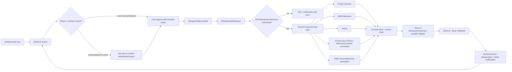

# Phase 10: App AI Chat UI + Read-Only Context Tools - Research

**Researched:** 2026-06-02  
**Domain:** Smart-ERD in-app AI chat, server-controlled read context tools, React global drawer UI  
**Confidence:** HIGH

<user_constraints>
## User Constraints (from CONTEXT.md)

All copied constraints in this block are from `.planning/phases/10-app-ai-chat-ui-read-only-context-tools/10-CONTEXT.md`. [VERIFIED: 10-CONTEXT.md]

### Locked Decisions

## Implementation Decisions

### Chat Entry and Persistence

**Decision D-01:** Use a global right-side AI drawer, not page-embedded chat panels.

**Decision D-02:** The AI drawer is available after login across every screen.

**Decision D-03:** Drawer open/closed state and current conversation must survive route changes.

**Decision D-04:** Chat messages survive browser refresh using browser-local persistence, not server persistence.

**Decision D-05:** Chat resets only when the user explicitly starts a new conversation; route changes, refresh, and context changes must not implicitly reset it.

**Decision D-06:** Chat supports questions that name or compare projects; it is not hard-bound to one project screen.

### Context Selection and Disambiguation

**Decision D-07:** Default context is inherited from the active route when a team/project context exists.

**Decision D-08:** Drawer allows the user to manually change context.

**Decision D-09:** On weak project context screens, the chat must ask for explicit scope before project-data questions.

**Decision D-10:** Multi-project questions may expand to all accessible projects in the current team.

**Decision D-11:** Cross-team/all-team/all-project querying across every team is excluded from the MVP.

**Decision D-12:** Ambiguous, misspelled, or conflicting project names must ask for confirmation instead of guessing.

**Decision D-13:** The drawer should show a persistent context bar.

**Decision D-14:** Each answer should show source chips for the actual context used.

### Read Tool Selection and Data Depth

**Decision D-15:** Read tools should be selected per question; do not send a full project data bundle on every provider request.

**Decision D-16:** Initial read coverage includes project/business overview, WBS, milestones, issues, TODOs, and WBS work history/comments.

**Decision D-17:** Read results should be summary-first: counts, statuses, priority distribution, delayed/risky/incomplete/unassigned items, recent changes.

**Decision D-18:** Detailed rows should be loaded only when explicitly asked or needed by follow-up context.

**Decision D-19:** TODO reads default to the current user's own TODOs.

**Decision D-20:** Member TODO summaries may be supported when the question explicitly asks about a member and the current user has access.

**Decision D-21:** Member-wide TODO reads should stay summary-oriented and avoid exposing private detail not necessary for the answer.

**Decision D-22:** WBS work history/comment reads default to recent summaries.

### Response Presentation

**Decision D-23:** Chat responses should be presented in a card structure separating confirmed facts, interpretation/proposal, and items needing confirmation.

**Decision D-24:** Source chips should be attached to answers, for example `A Project - issues 12`, `B Project - WBS 7`.

**Decision D-25:** Tone should match work-report style: conclusion first, risks/delays/next checks short and explicit.

**Decision D-26:** If project/scope/period/target is unclear, ask a confirmation question first instead of answering from guessed context.

### Security/Boundaries

**Decision D-27:** AI-visible project data must be assembled by server-side read tools after validating current user, team, project, and resource scope.

**Decision D-28:** The frontend must call Spring HTTP APIs through typed API modules; it must not call Codex, Electron IPC, or provider runtime directly.

**Decision D-29:** Raw access tokens, refresh tokens, session cookies, DB credentials, and arbitrary environment values must never be included in prompts, provider context, frontend responses, or browser-local chat storage.

**Decision D-30:** Server-stored chat history, audit/history UI, action proposal schema, action preview/diff/approval/cancel, and write execution are out of Phase 10.

### the agent's Discretion

The agent may choose:

- Exact frontend component names, store shape, and local persistence format, as long as global drawer behavior, route-independent persistence, user-controlled reset, and server-only read-tool auth boundary are preserved.
- Exact read tool endpoint/service shapes, as long as read scope is server-authorized and summary-first/question-selected.

### Deferred Ideas (OUT OF SCOPE)

Move these to later phases:

- Server-stored chat history and audit/history lookup. Phase 11 owns this.
- Action proposal schema, preview/diff, approval/cancel UX. Phase 11 owns this.
- Write tools that mutate WBS/issues/TODOs/reports. Phase 12 owns this.
- Cross-team/all-team querying. Excluded from Phase 10 MVP.
</user_constraints>

<phase_requirements>
## Phase Requirements

| ID | Description | Research Support |
|----|-------------|------------------|
| AI-CHAT-01 | A user can ask Smart-ERD work questions in an in-app chatbot and receive responses. | Use a global authenticated React drawer, typed Spring API module, and Phase 9 provider execution gateway as the backend provider boundary. [VERIFIED: REQUIREMENTS.md + App.tsx + AiProviderController.java] |
| AI-CHAT-02 | Chatbot clearly uses current team/project context or lets user select context. | Resolve route context in the client, display a persistent context bar, and ask the backend to validate or disambiguate team/project scope before read tools run. [VERIFIED: 10-CONTEXT.md + ProjectWbsPage.tsx + DictionaryPage.tsx] |
| AI-READ-01 | AI can read business overview/project summary. | Use `ProjectService.getBusinessOverview` and project detail/list services through an application-layer AI read service, not controller-to-controller calls. [VERIFIED: ProjectService.java + ProjectController.java] |
| AI-READ-02 | AI can read WBS/milestones. | Use WBS tree/comment/activity and milestone read services/controllers as source boundaries, with server-side summary shaping. [VERIFIED: WbsController.java + MilestoneController.java + WorkItemHistoryService.java] |
| AI-READ-03 | AI can read issues, personal TODOs, WBS work history/comments. | Use issue filters, current-user TODO service, and WBS history/comment services; member TODO summaries need an explicit authorization policy before exposing non-owner data. [VERIFIED: ProjectIssueController.java + ProjectTodoService.java + WorkItemHistoryService.java] [ASSUMED: member TODO policy not yet encoded] |
| AI-READ-04 | All read tool calls validate existing user/team/project/resource auth and scope. | Reuse `ProjectContextLoader`, `SelectedResourceValidator`, project issue services, TODO owner checks, and WBS target existence checks for every read scope. [VERIFIED: ProjectContextLoader.java + SelectedResourceValidator.java + ProjectTodoAccessService.java] |
</phase_requirements>

## Summary

Phase 10 should be planned as a server-mediated AI chat feature, not as a frontend/provider integration. Phase 9 already established the provider boundary: Spring HTTP API -> `AiExecutionGateway` -> provider adapter -> schema validation/audit, with sanitized metadata-only context and no Electron IPC or frontend provider runtime. [VERIFIED: 09-SUMMARY.md + AiExecutionGateway.java + AiProviderController.java] Phase 10 should add a chat-specific orchestration layer that resolves scope, selects read tools, assembles compact authorized facts, and then calls or extends the Phase 9 gateway with enriched, sanitized context. [VERIFIED: 10-CONTEXT.md] [ASSUMED: exact service names are planner discretion]

The frontend responsibility is the authenticated global drawer, context bar, message state, local refresh persistence, and structured response presentation. [VERIFIED: 10-CONTEXT.md + App.tsx + Header.tsx] The backend responsibility is authoritative context resolution, project/resource authorization, read-tool selection, fact/source-chip construction, provider request shaping, and output validation. [VERIFIED: README.md + AiExecutionGateway.java + ProjectContextLoader.java]

**Primary recommendation:** Implement `AiChatExecutionService` plus `AiReadContextService` on the Spring side, backed by existing project/WBS/issue/TODO/history services, and mount a React global right-side `AiChatDrawer` with Zustand/localStorage persistence and typed API calls. [VERIFIED: 10-CONTEXT.md + README.md + client/package.json] [ASSUMED: component/service names]

## Project Constraints (from CLAUDE.md/README.md)

- `AGENTS.md` is absent in the repo root; project instructions come from `CLAUDE.md`, `README.md`, and `DESIGN.md`. [VERIFIED: shell check + CLAUDE.md + README.md + DESIGN.md]
- User-facing prose should be Korean; technical identifiers remain unchanged. [VERIFIED: CLAUDE.md]
- Frontend API calls must go through typed API modules and shared constants such as `STORAGE_KEYS`, `ROUTES`, and `queryKeys`. [VERIFIED: CLAUDE.md + storage.ts + query-keys.ts + aiProviderApi.ts]
- React 19 code should use the `ref` prop convention instead of new `forwardRef` usage. [VERIFIED: CLAUDE.md + client/package.json]
- UI strings should use the existing i18n pattern, not hardcoded visible text. [VERIFIED: CLAUDE.md + client/src/i18n]
- UI styling should follow the Technical Editorial design language, warm paper tokens, semantic accent color for AI (`#C65D2E`), and existing UI primitives. [VERIFIED: DESIGN.md]
- AI integration must keep domain logic independent of provider SDKs; controllers/pages/components must not call LLM/provider runtime directly. [VERIFIED: README.md]
- AI output that affects persisted business state requires validation and approval; Phase 10 is read-only and must not introduce write execution. [VERIFIED: README.md + 10-CONTEXT.md]

## Architectural Responsibility Map

| Capability | Primary Tier | Secondary Tier | Rationale |
|------------|--------------|----------------|-----------|
| Global AI drawer, input, message list | Browser / Client | API / Backend | The drawer is a UI surface available after login and must survive route changes; backend only receives explicit chat execution requests. [VERIFIED: 10-CONTEXT.md + App.tsx] |
| Browser refresh persistence | Browser / Client | - | Decisions require browser-local persistence and exclude server chat history. [VERIFIED: 10-CONTEXT.md] |
| Route context inheritance | Browser / Client | API / Backend | Client can derive current team/project from route params, but backend must validate that scope before data is read. [VERIFIED: ProjectWbsPage.tsx + ProjectContextLoader.java] |
| Context disambiguation | API / Backend | Browser / Client | Backend owns authoritative accessible project lookup; client displays confirmation choices and selected context. [VERIFIED: 10-CONTEXT.md + ProjectService.java] |
| Read tool selection | API / Backend | Domain Services | Tool choice and data shaping happen before provider execution; domain services provide authorized source data. [VERIFIED: README.md + ProjectService.java + WbsController.java] |
| Project overview/WBS/milestone/issue/TODO/history reads | API / Backend | Database / Storage | Existing Spring services enforce team/project/resource scope and query persisted project data. [VERIFIED: ProjectContextLoader.java + ProjectIssueService.java + ProjectTodoService.java + WorkItemHistoryService.java] |
| Provider invocation | API / Backend | External provider adapter | Phase 9 provider calls are behind Spring and `AiProvider` adapters. [VERIFIED: AiExecutionGateway.java + LocalCodexProcessProvider.java] |
| Facts vs inference presentation | Browser / Client | API / Backend | Backend should produce source-chip metadata and schema-constrained response sections; client renders them as separate cards. [VERIFIED: 10-CONTEXT.md + provider-output.schema.json] |
| Authorization and privacy | API / Backend | Browser / Client | Server validates each read; client must not persist secrets or raw provider context. [VERIFIED: 10-CONTEXT.md + ProjectContextLoader.java + CodexProcessRunner.java] |

## Standard Stack

### Core

| Library / System | Version | Purpose | Why Standard |
|------------------|---------|---------|--------------|
| Spring Boot / Java | Boot `3.5.11`, Java toolchain `25` | AI chat HTTP API, application services, validation, security | Existing backend stack and Phase 9 AI provider gateway are already implemented in Spring. [VERIFIED: build.gradle + AiExecutionGateway.java] |
| Spring Security OAuth2 Resource Server JWT | Existing backend dependency | Authenticated `Jwt` principal for AI APIs | Spring Security documents JWT resource server support for bearer-token validation and principal mapping. [CITED: https://docs.spring.io/spring-security/reference/servlet/oauth2/resource-server/jwt.html] |
| Phase 9 `AiExecutionGateway` / `AiProvider` | Existing code | Provider execution, output validation, audit metadata | Phase 9 gateway already authorizes project context, sends sanitized context, validates provider JSON, and writes metadata audit. [VERIFIED: AiExecutionGateway.java + AiProviderRequest.java + AiExecutionAudit.java] |
| React | Repo range `^19.2.4`, npm latest `19.2.7` modified 2026-06-01 | Global drawer UI and response rendering | Existing frontend stack. [VERIFIED: client/package.json + npm view react] |
| TanStack React Query | Repo range `^5.90.20`, npm latest `5.100.14` modified 2026-05-23 | Server state for chat execution/status/context lookup | Official docs use serializable array query keys for cache identity. [VERIFIED: client/package.json + npm view @tanstack/react-query] [CITED: https://tanstack.com/query/latest/docs/framework/react/guides/query-keys] |
| Zustand | Repo range `^5.0.0`, npm latest `5.0.14` modified 2026-05-28 | Drawer open state, messages, selected context, local persistence | Official docs provide `persist` middleware with `name`, `partialize`, `version`, and default localStorage support. [VERIFIED: client/package.json + npm view zustand] [CITED: https://raw.githubusercontent.com/pmndrs/zustand/main/docs/middlewares/persist.md] |
| Radix Dialog via existing UI primitives | `@radix-ui/react-dialog` repo `^1.1.15`, npm latest `1.1.15` modified 2026-06-02 | Accessible drawer/sheet foundation | Radix Dialog supports modal mode, focus trapping, controlled state, screen reader title/description, and Escape close. [VERIFIED: client/package.json + npm view @radix-ui/react-dialog] [CITED: https://www.radix-ui.com/primitives/docs/components/dialog] |

### Supporting

| Library / System | Version | Purpose | When to Use |
|------------------|---------|---------|-------------|
| `cmdk` / `components/ui/command` | Repo `^1.1.1`, npm latest `1.1.1` modified 2025-08-27 | Project/context chooser and disambiguation UI | Use for searchable accessible project selection in the drawer. [VERIFIED: client/package.json + command.tsx + npm view cmdk] |
| `lucide-react` | Repo `^0.563.0`, npm latest `1.17.0` modified 2026-05-28 | Drawer trigger, send/reset/context/source icons | Existing project uses lucide icons in UI. [VERIFIED: client/package.json] |
| `localStorage` | Browser API | Refresh-surviving local chat persistence | MDN documents that `localStorage` data is saved across browser sessions and has no expiration time. [CITED: https://developer.mozilla.org/en-US/docs/Web/API/Window/localStorage] |
| Bean Validation + Jackson JSON schema validation | Existing backend | DTO validation and provider response contract | Phase 9 already validates provider output DTOs and schema-constrained JSON. [VERIFIED: ProviderOutputValidator.java + provider-output.schema.json] |

### Alternatives Considered

| Instead of | Could Use | Tradeoff |
|------------|-----------|----------|
| Existing Radix Dialog wrapper | New drawer dependency such as a sheet/drawer package | Do not add a package; a right-side sheet wrapper can be built on existing `@radix-ui/react-dialog` primitives. [VERIFIED: components/ui/dialog.tsx + client/package.json] |
| Zustand persisted store | Ad hoc `localStorage` reads in components | Ad hoc storage would scatter serialization/reset/privacy rules; Zustand persist centralizes partial persistence and migration. [CITED: https://raw.githubusercontent.com/pmndrs/zustand/main/docs/middlewares/persist.md] |
| Existing Phase 9 provider gateway | Direct Codex/Electron IPC/frontend provider calls | Direct provider calls violate Phase 10 D-28 and README AI architecture. [VERIFIED: 10-CONTEXT.md + README.md] |
| Backend read context summaries | Sending full project bundles to the model | Full bundles violate D-15 and increase privacy/token exposure. [VERIFIED: 10-CONTEXT.md] |

**Installation:** no new external packages should be installed for Phase 10. [VERIFIED: client/package.json + build.gradle]

**Version verification:** versions above were checked with `npm view` for frontend packages and local `build.gradle` for backend stack. [VERIFIED: npm view + build.gradle]

## Package Legitimacy Audit

Phase 10 should install no new external packages, so the package legitimacy gate is not required for execution planning. Existing package names came from `client/package.json` and `build.gradle`, not from training data or non-authoritative discovery. [VERIFIED: client/package.json + build.gradle]

| Package | Registry | Age | Downloads | Source Repo | slopcheck | Disposition |
|---------|----------|-----|-----------|-------------|-----------|-------------|
| None new | - | - | - | - | Not run | Approved: no install step |

**Packages removed due to slopcheck [SLOP] verdict:** none. [VERIFIED: no new install recommendation]  
**Packages flagged as suspicious [SUS]:** none. [VERIFIED: no new install recommendation]

## Architecture Patterns

### System Architecture Diagram

This diagram maps the primary ask-to-answer flow for Phase 10. [VERIFIED: 10-CONTEXT.md + 09-SUMMARY.md + README.md]



### Recommended Project Structure

```text
src/main/java/com/smarterd/api/ai/
├── AiChatController.java              # chat-specific HTTP boundary
├── request/AiChatRequest.java         # user message + requested scope
└── response/AiChatResponse.java       # structured answer sections + source chips

src/main/java/com/smarterd/application/ai/chat/
├── AiChatExecutionService.java        # orchestrates context resolution, read tools, provider execution
├── AiChatContextResolver.java         # route/manual/named-project scope validation and disambiguation
├── AiReadContextService.java          # question-selected read summaries
└── AiSourceChipFactory.java           # backend-owned source chip metadata

client/src/features/ai-chat/
├── api/aiChatApi.ts                   # typed Spring HTTP calls
├── components/AiChatDrawer.tsx        # global right-side drawer
├── components/AiContextBar.tsx        # current context + project chooser
├── components/AiResponseCards.tsx     # facts / inference / confirmation sections
├── stores/aiChatStore.ts              # Zustand partial persistence
└── hooks/useAiRouteContext.ts         # route-derived context detection
```

Recommended names are planning suggestions; ownership boundaries are the verified part. [ASSUMED: exact names] [VERIFIED: README.md + current package structure]

### Pattern 1: Chat API Is a Use Case, Provider API Is an Implementation Boundary

**What:** Add a chat-facing service/controller that owns Phase 10 context resolution and read-tool orchestration; reuse or extend Phase 9 gateway only after authorized facts are assembled. [VERIFIED: AiExecutionGateway.java + 10-CONTEXT.md]

**When to use:** Every in-app chat request, including route-inherited, manually selected, and multi-project current-team questions. [VERIFIED: 10-CONTEXT.md]

**Example:**

```java
// Source: local pattern from AiProviderController + AiExecutionGateway.
// Shape is illustrative; exact names are planner discretion. [ASSUMED]
AiChatResponse ask(Jwt principal, AiChatRequest request) {
    ResolvedAiScope scope = contextResolver.resolve(principal.getSubject(), request.scope(), request.message());
    if (scope.requiresConfirmation()) {
        return AiChatResponse.confirmation(scope.confirmationOptions());
    }

    AiReadContext readContext = readContextService.collect(principal.getSubject(), scope, request.message());
    AiExecutionView execution = aiExecutionGateway.execute(
        ExecuteCommand.forChat(principal.getSubject(), scope.primaryTeamId(), readContext)
    );
    return responseAssembler.from(execution, readContext.sourceChips());
}
```

### Pattern 2: Backend Source Chips, Frontend Rendering

**What:** Source chips must be computed from read tools actually called, not generated by the model. [VERIFIED: 10-CONTEXT.md]

**When to use:** Every final answer and every confirmation-safe answer that cites available facts. [VERIFIED: 10-CONTEXT.md]

**Example:**

```typescript
// Source: local typed API pattern from aiProviderApi.ts and response-card requirement from 10-CONTEXT.md.
export type AiSourceChip = {
  label: string
  teamId: number
  projectId?: number
  tool: 'PROJECT_OVERVIEW' | 'WBS' | 'MILESTONE' | 'ISSUE' | 'TODO' | 'WBS_HISTORY'
  count?: number
}
```

### Pattern 3: Persist Only Presentation State

**What:** Persist drawer state, selected context labels/IDs, and rendered messages; do not persist raw provider context, raw read payloads, tokens, cookies, env values, or credentials. [VERIFIED: 10-CONTEXT.md + CodexProcessRunner.java]

**When to use:** Zustand `persist` store for refresh survival. [CITED: https://raw.githubusercontent.com/pmndrs/zustand/main/docs/middlewares/persist.md]

**Example:**

```typescript
// Source: Zustand persist docs + project storage constant pattern. [CITED: https://raw.githubusercontent.com/pmndrs/zustand/main/docs/middlewares/persist.md] [VERIFIED: storage.ts]
persist(
  (set) => ({
    isOpen: false,
    selectedContext: null,
    messages: [],
    startNewConversation: () => set({ messages: [] }),
  }),
  {
    name: STORAGE_KEYS.AI_CHAT_STATE,
    version: 1,
    partialize: (state) => ({
      isOpen: state.isOpen,
      selectedContext: state.selectedContext,
      messages: state.messages,
    }),
  },
)
```

### Anti-Patterns to Avoid

- **Calling `/api/ai/provider/execute` directly from the drawer without a chat layer:** existing provider execute requires `teamId` and `projectId`, which does not cover weak context, current-team multi-project questions, or backend disambiguation. [VERIFIED: ai-provider.ts + AiProviderController.java + 10-CONTEXT.md]
- **Using frontend-selected IDs as authorization proof:** route params and manual selection are input only; backend must revalidate user/team/project/resource scope for every read. [VERIFIED: 10-CONTEXT.md + ProjectContextLoader.java]
- **Asking the model to count raw issue/WBS/TODO arrays:** counts, status distributions, risk/delay flags, and source-chip counts should be computed by typed server code before provider execution. [VERIFIED: 10-CONTEXT.md]
- **Parsing markdown headings to separate facts from inference:** the provider response schema should encode facts/inference/confirmation sections so validation can enforce the presentation contract. [VERIFIED: provider-output.schema.json + ProviderOutputValidator.java]

## Don't Hand-Roll

| Problem | Don't Build | Use Instead | Why |
|---------|-------------|-------------|-----|
| Provider process execution | New Codex/Electron process runner | Phase 9 `AiProvider` / `LocalCodexProcessProvider` | Existing runner already isolates cwd, fixes argv, allowlists env, validates output, and audits metadata. [VERIFIED: LocalCodexProcessProvider.java + CodexProcessRunner.java] |
| Auth and scope checks | Client-side checks or duplicated SQL checks | `ProjectContextLoader`, existing domain/application services, `SelectedResourceValidator` | Existing services already enforce membership, project-team binding, resource ownership, and selected resource validation. [VERIFIED: ProjectContextLoader.java + SelectedResourceValidator.java] |
| Drawer accessibility | Custom focus trap/overlay keyboard handling | Existing Radix Dialog-based primitives | Radix Dialog supports modal behavior, focus trap, controlled state, screen-reader labels, and Escape close. [CITED: https://www.radix-ui.com/primitives/docs/components/dialog] |
| Server state fetching | Raw `fetch` in components | Existing axios API modules + TanStack Query keys | Project conventions require typed API modules; TanStack Query cache keys are array-based and serializable. [VERIFIED: CLAUDE.md + aiProviderApi.ts] [CITED: https://tanstack.com/query/latest/docs/framework/react/guides/query-keys] |
| Refresh persistence | Scattered direct `localStorage` writes | Zustand `persist` + `STORAGE_KEYS` | Centralized partial persistence controls what data survives refresh. [CITED: https://raw.githubusercontent.com/pmndrs/zustand/main/docs/middlewares/persist.md] [VERIFIED: storage.ts] |
| Facts/source attribution | Model-generated citation text | Backend-generated source chips from read-tool results | D-14/D-24 require chips for actual context used. [VERIFIED: 10-CONTEXT.md] |
| LLM security controls | Prompt-only restrictions | Server-side tool selection, authorization, schema validation, no-write contract | OWASP flags prompt injection, insecure output handling, sensitive disclosure, and excessive agency as LLM app risks. [CITED: https://owasp.org/www-project-top-10-for-large-language-model-applications/] |

**Key insight:** Phase 10 should treat the model as a summarizer over authorized server facts, not as a data access layer. [VERIFIED: 10-CONTEXT.md + README.md]

## Common Pitfalls

### Pitfall 1: Treating Phase 9 Provider API as the Chat API

**What goes wrong:** The drawer calls the provider endpoint with only one `teamId/projectId`, so multi-project, weak-context, and disambiguation requirements fail. [VERIFIED: AiProviderController.java + ai-provider.ts + 10-CONTEXT.md]

**Why it happens:** Phase 9 was a provider gateway, not a product chat UX. [VERIFIED: 09-CONTEXT.md + 09-SUMMARY.md]

**How to avoid:** Plan a chat use case service that resolves scope and composes read context before provider execution. [VERIFIED: 10-CONTEXT.md]

**Warning signs:** Frontend request DTO still requires a single `projectId` for every message; no confirmation response exists; no source-chip metadata is returned. [VERIFIED: ai-provider.ts + provider-output.schema.json]

### Pitfall 2: Leaking Private Project Data Through Local Persistence

**What goes wrong:** Browser-local chat storage contains raw read payloads, prompt context, tokens, cookies, or credentials. [VERIFIED: 10-CONTEXT.md]

**Why it happens:** `localStorage` survives browser sessions, so persisted data can outlive the current page session. [CITED: https://developer.mozilla.org/en-US/docs/Web/API/Window/localStorage]

**How to avoid:** Persist only rendered message sections, context labels/IDs, timestamps, and source-chip display metadata; never persist raw provider context or secrets. [VERIFIED: 10-CONTEXT.md]

**Warning signs:** Persisted state includes `context`, `factsRaw`, `Authorization`, `refreshToken`, `cookie`, `env`, or full DTO arrays. [VERIFIED: 10-CONTEXT.md]

### Pitfall 3: TODO Privacy Regression

**What goes wrong:** Phase 10 exposes another member's personal TODO details through the AI because the summary path bypasses owner checks. [VERIFIED: ProjectTodoService.java + ProjectTodoAccessService.java]

**Why it happens:** Existing TODO list/detail APIs are current-user-owned; D-20 allows member summaries only if explicit and authorized, but the exact policy is not yet encoded. [VERIFIED: 10-CONTEXT.md + ProjectTodoService.java] [ASSUMED: member summary policy gap]

**How to avoid:** Keep default TODO reads to current user; add a separate member-summary read path with explicit role/policy checks before using it. [VERIFIED: 10-CONTEXT.md]

**Warning signs:** AI read service queries TODOs by arbitrary `ownerId` without a role/policy service. [VERIFIED: ProjectTodoAccessService.java]

### Pitfall 4: Model Guesses Scope Instead of Asking Confirmation

**What goes wrong:** A misspelled or ambiguous project name receives an answer from the wrong project. [VERIFIED: 10-CONTEXT.md]

**Why it happens:** Disambiguation is left to prompt wording instead of backend resolver logic. [VERIFIED: 10-CONTEXT.md]

**How to avoid:** Detect ambiguous/missing scope before read tools run and return a confirmation response with accessible candidate projects. [VERIFIED: 10-CONTEXT.md]

**Warning signs:** Provider receives user message before project candidates are resolved; source chips appear for a guessed project. [VERIFIED: 10-CONTEXT.md]

### Pitfall 5: Source Chips Become Decorative

**What goes wrong:** Chips are generated from model prose and do not reflect actual read tools/data counts. [VERIFIED: 10-CONTEXT.md]

**Why it happens:** Source attribution is treated as a UI concern only. [VERIFIED: 10-CONTEXT.md]

**How to avoid:** Backend returns chips from the read context assembly result, and the UI renders them without letting the model invent them. [VERIFIED: 10-CONTEXT.md]

**Warning signs:** `sourceChips` only exists in model output schema, not in read-tool result metadata. [VERIFIED: provider-output.schema.json]

## Code Examples

Verified patterns from official and local sources:

### TanStack Query Key Shape

```typescript
// Source: TanStack Query docs. [CITED: https://tanstack.com/query/latest/docs/framework/react/guides/query-keys]
useQuery({ queryKey: ['ai-chat', teamId, { projectIds, mode: 'summary' }], queryFn })
```

### Zustand Partial Persistence

```typescript
// Source: Zustand persist docs. [CITED: https://raw.githubusercontent.com/pmndrs/zustand/main/docs/middlewares/persist.md]
persist(
  (set) => ({ messages: [], selectedContext: null }),
  {
    name: 'smart-erd.ai-chat',
    version: 1,
    partialize: (state) => ({ messages: state.messages, selectedContext: state.selectedContext }),
  },
)
```

### Spring Controller Principal Pattern

```java
// Source: local AiProviderController pattern. [VERIFIED: AiProviderController.java]
@PostMapping("/execute")
public ResponseEntity<AiChatResponse> execute(
        @AuthenticationPrincipal Jwt jwt,
        @Valid @RequestBody AiChatRequest request
) {
    return ResponseEntity.ok(aiChatExecutionService.execute(jwt.getSubject(), request));
}
```

### Read Context Result Shape

```java
// Source: Phase 10 D-14/D-17/D-23. Exact type name is planner discretion. [VERIFIED: 10-CONTEXT.md] [ASSUMED: type name]
public record AiReadContext(
        List<AiFact> confirmedFacts,
        List<AiSourceChip> sourceChips,
        Map<String, Object> sanitizedProviderContext
) {
}
```

## State of the Art

| Old Approach | Current Approach | When Changed | Impact |
|--------------|------------------|--------------|--------|
| Frontend/provider direct calls | Server-mediated provider gateway and typed HTTP API | Phase 9 | Phase 10 should enrich the gateway, not bypass it. [VERIFIED: 09-SUMMARY.md + 10-CONTEXT.md] |
| Prompt-only safety | Server-side scope checks, schema validation, no-write contract | Phase 9 and Phase 10 scope | Reduces prompt injection, insecure output handling, sensitive disclosure, and excessive agency risk. [VERIFIED: AiExecutionGateway.java + ProviderOutputValidator.java] [CITED: https://owasp.org/www-project-top-10-for-large-language-model-applications/] |
| Single answer string | Structured facts / interpretation / needs-confirmation cards | Phase 10 decision | Requires provider response schema update or chat-specific response assembler. [VERIFIED: 10-CONTEXT.md + provider-output.schema.json] |
| Full context bundle | Question-selected read summaries | Phase 10 decision | Planner should create read-tool selection tasks before UI polish tasks. [VERIFIED: 10-CONTEXT.md] |

**Deprecated/outdated for this phase:**

- Direct use of `/api/ai/provider/execute` as the product chat endpoint: it is too narrow for Phase 10 context rules. [VERIFIED: AiProviderController.java + 10-CONTEXT.md]
- Markdown-only response structure: it cannot reliably enforce facts vs inference separation. [VERIFIED: ProviderOutputValidator.java + provider-output.schema.json]
- Server chat history: explicitly deferred to Phase 11. [VERIFIED: 10-CONTEXT.md]

## Assumptions Log

| # | Claim | Section | Risk if Wrong |
|---|-------|---------|---------------|
| A1 | Exact Java/TypeScript names such as `AiChatExecutionService`, `AiReadContextService`, and `AiChatDrawer` are recommendations, not locked project decisions. | Summary / Project Structure / Code Examples | Low: planner can rename without changing architecture. |
| A2 | Member-wide TODO summaries need a new explicit authorization policy because current personal TODO paths are owner-focused. | Phase Requirements / Pitfalls / Open Questions | Medium: wrong policy could expose private TODO details or block a required use case. |
| A3 | Local chat retention cap/TTL is not locked; research recommends versioned partial persistence but not an exact retention limit. | Open Questions / Patterns | Low-Medium: storage can grow or retain more PM text than desired if planner omits limits. |
| A4 | Chat-specific response schema can be introduced as provider-response v2 or assembled after Phase 9 gateway output; exact migration path is not locked. | Open Questions / State of the Art | Medium: planner must avoid breaking Phase 9 tests and provider compatibility. |

## Open Questions

1. **Member TODO summary authorization**
   - What we know: current personal TODO reads are owner-scoped, while D-20 allows member summaries if explicit and authorized. [VERIFIED: ProjectTodoService.java + 10-CONTEXT.md]
   - What's unclear: whether all team members, project managers, or only specific roles may ask about another member's TODO summary. [ASSUMED]
   - Recommendation: add a planning checkpoint to define the member-summary auth rule before implementing non-owner TODO reads. [ASSUMED]

2. **Local message retention cap**
   - What we know: browser-local persistence is required and server persistence is deferred. [VERIFIED: 10-CONTEXT.md]
   - What's unclear: max message count, max storage size, or retention duration. [ASSUMED]
   - Recommendation: cap persisted messages and store only presentation state; choose the cap during planning. [ASSUMED]

3. **Provider response schema evolution**
   - What we know: current Phase 9 schema returns a single `answer` plus optional `actions` and `error`. [VERIFIED: provider-output.schema.json + AiProviderResult.java]
   - What's unclear: whether to replace Phase 9 schema globally or create a chat-specific v2 schema/assembler. [ASSUMED]
   - Recommendation: prefer a chat-specific v2 response contract so Phase 9 provider tests remain stable while Phase 10 gets facts/inference/confirmation sections. [ASSUMED]

## Environment Availability

| Dependency | Required By | Available | Version | Fallback |
|------------|-------------|-----------|---------|----------|
| Java toolchain 25 | Backend build/tests | ✓ | Gradle detects Homebrew JDK `25.0.1`; shell `java` is `21.0.9` | Use `./gradlew`, not raw `javac`. [VERIFIED: java -version + ./gradlew javaToolchains] |
| Gradle | Backend build/tests | ✓ | `9.4.0` | - [VERIFIED: ./gradlew --version] |
| Node.js | Frontend build/tests | ✓ | `v22.20.0` | - [VERIFIED: node --version] |
| npm | Frontend package scripts | ✓ | `10.9.3` | Use `--cache /tmp/npm-cache-smarterd` if npm cache permission issue recurs. [VERIFIED: npm --version + CLAUDE.md] |
| Docker | Local DB/dev environment | ✓ | Server `29.1.2` | Use local services only if Docker unavailable. [VERIFIED: docker info] |
| PostgreSQL CLI | DB inspection/dev support | ✓ | `psql 18.1` | Dockerized Postgres if local server absent. [VERIFIED: psql --version] |
| Codex CLI | Phase 9 local provider runtime | ✓ | `codex-cli 0.136.0` | Provider can run `noop` mode for tests/dev without local Codex. [VERIFIED: codex --version + AiProperties.java] |
| Context7 CLI | Documentation lookup fallback | ✗ | - | Official docs/web sources used instead. [VERIFIED: command -v ctx7] |

**Missing dependencies with no fallback:** none for planning. [VERIFIED: environment audit]

**Missing dependencies with fallback:**

- Context7 CLI is unavailable; official documentation URLs were used for framework/library claims. [VERIFIED: command -v ctx7] [CITED: https://tanstack.com/query/latest/docs/framework/react/guides/query-keys]

## Validation Architecture

### Test Framework

| Property | Value |
|----------|-------|
| Framework | Backend: JUnit/Spring Boot Test via Gradle; Frontend: TypeScript compile + Node test runner; E2E: Playwright smoke specs. [VERIFIED: build.gradle + client/scripts/run-unit-tests.mjs + client/e2e/smoke] |
| Config file | Backend `build.gradle`; frontend `client/tsconfig.test.json`, `client/scripts/run-unit-tests.mjs`; E2E `client/playwright.config.ts`. [VERIFIED: file scan] |
| Quick run command | `./gradlew test --tests "com.smarterd.application.ai.*" --tests "com.smarterd.api.ai.*" && cd client && npm run test:unit` |
| Full suite command | `./gradlew test && cd client && npm run build && npm run test:unit` |

### Phase Requirements -> Test Map

| Req ID | Behavior | Test Type | Automated Command | File Exists? |
|--------|----------|-----------|-------------------|--------------|
| AI-CHAT-01 | Drawer can submit a chat question and render a response/error. | frontend unit + backend MVC + e2e smoke | `cd client && npm run test:unit`; `./gradlew test --tests "*AiChat*"` | ❌ Wave 0 |
| AI-CHAT-02 | Route context is inherited, manual context can override, ambiguous context asks confirmation. | frontend unit + backend service | `cd client && npm run test:unit`; `./gradlew test --tests "*AiChatContext*"` | ❌ Wave 0 |
| AI-READ-01 | Business overview/project summary read context is assembled after auth. | backend service | `./gradlew test --tests "*AiReadContext*"` | ❌ Wave 0 |
| AI-READ-02 | WBS and milestone summaries include counts/status/risk-ready fields. | backend service | `./gradlew test --tests "*AiReadContext*"` | ❌ Wave 0 |
| AI-READ-03 | Issues, own TODOs, authorized member TODO summaries, and WBS history summaries are selected per question. | backend service | `./gradlew test --tests "*AiReadContext*"` | ❌ Wave 0 |
| AI-READ-04 | Cross-team/project/resource/TODO-owner reads are denied before provider execution. | backend service + MVC | `./gradlew test --tests "*AiChat*"` | ❌ Wave 0; Phase 9 auth tests exist for provider baseline. [VERIFIED: AiExecutionGatewayTest.java + AiProviderControllerMvcTest.java] |

### Sampling Rate

- **Per task commit:** run targeted backend or frontend unit tests for touched layer. [VERIFIED: existing test scripts]
- **Per wave merge:** `./gradlew test && cd client && npm run test:unit`. [VERIFIED: build.gradle + client/package.json]
- **Phase gate:** backend full tests, frontend build, frontend unit tests, and one Playwright smoke for drawer open/context/answer card if E2E environment is available. [VERIFIED: client/e2e/smoke]

### Wave 0 Gaps

- [ ] `src/test/java/com/smarterd/application/ai/chat/AiChatContextResolverTest.java` - covers AI-CHAT-02 and ambiguous scope.
- [ ] `src/test/java/com/smarterd/application/ai/chat/AiReadContextServiceTest.java` - covers AI-READ-01 through AI-READ-04.
- [ ] `src/test/java/com/smarterd/api/ai/AiChatControllerMvcTest.java` - covers authenticated chat endpoint and denial paths.
- [ ] `client/test/unit/ai-chat-store.test.ts` - covers route-independent persistence, explicit reset, and no-secret persistence.
- [ ] `client/test/unit/ai-chat-context.test.ts` - covers route/manual/weak context resolver behavior.
- [ ] `client/test/unit/ai-chat-response-cards.test.ts` - covers facts/inference/confirmation/source-chip rendering.
- [ ] `client/e2e/smoke/ai-chat-drawer.spec.ts` - covers authenticated drawer smoke and response card visibility.

## Security Domain

Security enforcement is enabled because `.planning/config.json` does not disable it and `workflow.nyquist_validation` is true. [VERIFIED: .planning/config.json]

### Applicable ASVS Categories

| ASVS Category | Applies | Standard Control |
|---------------|---------|------------------|
| V2 Authentication | yes | Spring Security JWT principal through `@AuthenticationPrincipal Jwt`; no anonymous AI chat. [VERIFIED: AiProviderController.java] [CITED: https://docs.spring.io/spring-security/reference/servlet/oauth2/resource-server/jwt.html] |
| V3 Session Management | yes | Existing access/refresh token handling remains outside prompts/local chat storage; Phase 10 must not persist tokens in chat state. [VERIFIED: 10-CONTEXT.md + auth store/local storage files] |
| V4 Access Control | yes | `ProjectContextLoader`, existing project services, TODO owner checks, and selected resource validation per read. [VERIFIED: ProjectContextLoader.java + ProjectTodoAccessService.java + SelectedResourceValidator.java] |
| V5 Input Validation | yes | Bean Validation DTOs, enum-based filters, backend scope resolver, and provider output validation. [VERIFIED: AiProviderController.java + ProviderOutputValidator.java] |
| V6 Cryptography | yes | Do not hand-roll crypto; keep JWT/session handling in existing auth stack. [VERIFIED: README.md + Spring Security config files] |
| V8 Data Protection | yes | No raw tokens, cookies, DB credentials, arbitrary env values, raw read payloads, or provider context in prompts/frontend responses/local storage. [VERIFIED: 10-CONTEXT.md + CodexProcessRunner.java] |

### Known Threat Patterns for Smart-ERD AI Chat

| Pattern | STRIDE | Standard Mitigation |
|---------|--------|---------------------|
| Prompt injection asks the model to bypass project scope | Tampering / Information Disclosure | Backend-selected read tools only; model never receives tool execution authority or raw credentials. [CITED: https://owasp.org/www-project-top-10-for-large-language-model-applications/] [VERIFIED: 10-CONTEXT.md] |
| IDOR via forged `teamId`, `projectId`, `resourceId` | Information Disclosure / Tampering | Revalidate user/team/project/resource on every read through existing services before provider execution. [VERIFIED: ProjectContextLoader.java + SelectedResourceValidator.java] |
| Sensitive information disclosure in provider context | Information Disclosure | Use sanitized context only; keep env allowlist and exclude token/password/cookie/secret/datasource-like env names. [VERIFIED: CodexProcessRunner.java + AiProviderRequest.java] |
| Insecure output handling | Tampering / Elevation of Privilege | Structured JSON schema + Bean Validation; Phase 10 chat should reject action proposals or require empty actions. [VERIFIED: ProviderOutputValidator.java + ActionDraftValidator.java + 10-CONTEXT.md] [CITED: https://owasp.org/www-project-top-10-for-large-language-model-applications/] |
| Excessive agency | Elevation of Privilege | Phase 10 is read-only; no write actions, preview/diff, approval, or execution. [VERIFIED: 10-CONTEXT.md] [CITED: https://owasp.org/www-project-top-10-for-large-language-model-applications/] |
| Browser-local leakage | Information Disclosure | Persist presentation state only, use a dedicated `STORAGE_KEYS` key, cap stored messages, and clear on explicit new conversation/logout as planned behavior. [VERIFIED: 10-CONTEXT.md + storage.ts] [ASSUMED: cap/logout clear exact behavior] |

## Sources

### Primary (HIGH confidence)

- `.planning/phases/10-app-ai-chat-ui-read-only-context-tools/10-CONTEXT.md` - locked Phase 10 decisions, scope, and deferrals.
- `.planning/REQUIREMENTS.md` - AI-CHAT/AI-READ requirement definitions.
- `.planning/STATE.md` - project planning state and history.
- `CLAUDE.md`, `README.md`, `DESIGN.md` - project conventions, AI architecture, UI design language.
- `src/main/java/com/smarterd/application/ai/AiExecutionGateway.java` - Phase 9 provider gateway flow.
- `src/main/java/com/smarterd/api/ai/AiProviderController.java` - authenticated provider HTTP boundary.
- `src/main/java/com/smarterd/application/ai/provider/LocalCodexProcessProvider.java` and `CodexProcessRunner.java` - local provider process and env sanitization.
- `src/main/java/com/smarterd/application/project/ProjectContextLoader.java` and `SelectedResourceValidator.java` - scope validation.
- `src/main/java/com/smarterd/domain/project/service/ProjectService.java`, `ProjectTodoService.java`, `ProjectTodoAccessService.java`, `WorkItemHistoryService.java` - existing read boundaries.
- `client/package.json`, `client/src/App.tsx`, `Header.tsx`, `storage.ts`, `query-keys.ts`, `aiProviderApi.ts` - frontend stack and API/state conventions.

### Official Docs (HIGH confidence)

- TanStack Query query keys - https://tanstack.com/query/latest/docs/framework/react/guides/query-keys
- Zustand persist middleware - https://raw.githubusercontent.com/pmndrs/zustand/main/docs/middlewares/persist.md
- Radix Dialog - https://www.radix-ui.com/primitives/docs/components/dialog
- Spring Security JWT Resource Server - https://docs.spring.io/spring-security/reference/servlet/oauth2/resource-server/jwt.html
- OWASP Top 10 for LLM Applications - https://owasp.org/www-project-top-10-for-large-language-model-applications/
- MDN `localStorage` - https://developer.mozilla.org/en-US/docs/Web/API/Window/localStorage

### Secondary (MEDIUM confidence)

- npm registry `npm view` checks for current frontend package versions and modified timestamps.

### Tertiary (LOW confidence)

- None used as a decision source; assumptions are isolated in the Assumptions Log.

## Metadata

**Confidence breakdown:**

- Standard stack: HIGH - stack is already present in repo and versions were checked through local manifests/npm registry. [VERIFIED: client/package.json + build.gradle + npm view]
- Architecture: HIGH - Phase 9 gateway and current PM read-service boundaries are visible in code, and Phase 10 decisions tightly constrain ownership. [VERIFIED: 09-SUMMARY.md + 10-CONTEXT.md + code scan]
- Pitfalls: MEDIUM-HIGH - pitfalls derive from locked decisions, current code shape, and OWASP LLM risks; exact TODO member policy remains unresolved. [VERIFIED: 10-CONTEXT.md + OWASP docs] [ASSUMED: member TODO policy]

**Research date:** 2026-06-02  
**Valid until:** 2026-06-09 for package/version details; 2026-07-02 for architecture guidance.
